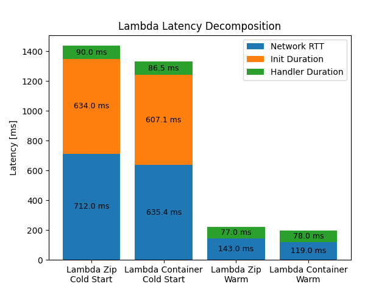
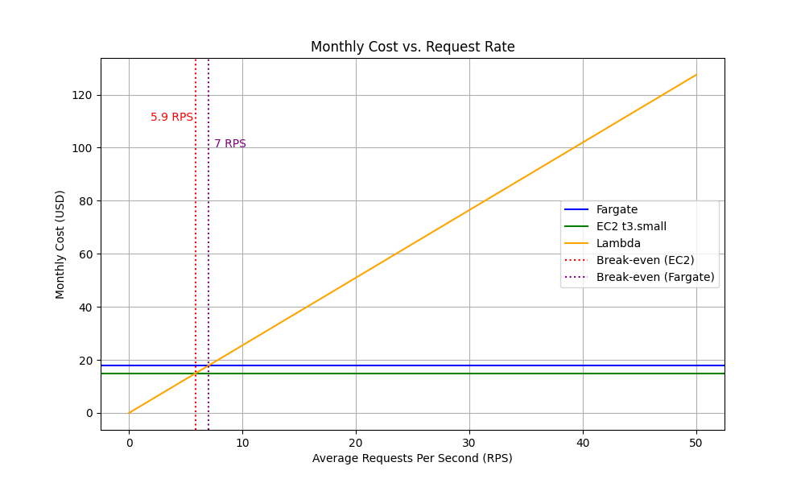

# Large Scale Computing - Lab4
Magdalena Pabisz

# Assignment 1
Successfully deployed all four environments. Responses from all endpoints have been collected and saved in `results/assignment-1-endpoints.txt`.

# Assignment 2 (scenario A)


**The container cold start is faster than the zip one**. Containers already have dependencies and required packages, so Lambda doesn't need to unpack them. On the other hand, zip packages take more time to extract dependencies and initialize at cold start.

# Assignment 3 (scenario B)
| Environment | Concurrency | p50 (ms) | p95 (ms) | p99 (ms) | Server avg (ms) |
|---|---|---|---|---|---|
| Lambda (zip) | 5 | 99 | 118 | 233 | 80 |
| Lambda (zip) | 10 | 93 | 117 | 158 | 75 |
| Lambda (container) | 5 | 93 | 115 | 140 | 69 |
| Lambda (container) | 10 | 93 | 114 | 147 | 73 |
| Fargate | 10 | 901 | 1199 | 1664 | 25 |
| Fargate | 50 | 4493 | 5086 | 5302 | 25 |
| EC2 | 10 | 200 | 262 | 290 | 31 |
| EC2 | 50 | 951 | 1218 | 1338 | 31 |

No cells meet the condition `p99 > 2 × p95`, however Lambda (zip, c=5) is really close.

Lambda's p50 stays almost at the same level, because each request is run in its own execution environment and there isn't any queue. Fargate and EC2 has higher p50 at hier cocurrency because requests must waint in a queue as thay share the same resources.

The difference between server-side query time and client-side p50 results from the fact that server-side time only measures query execution, whereas client-side p50 also includes additional factors such as network latency, request handling overhead, and queueing delays (in Fargate/EC2).


# Assignment 4 (scenario C)
| Environment | Concurrency | p50 (ms) | p95 (ms) | p99 (ms) | Max latency (ms) | Init Duration (ms) |
|---|---|---|---|---|---|---|
| Lambda (zip) | 10 | 96 | 1297 | 1442 | 1449 | 621 |
| Lambda (container) | 10 | 97 | 930 | 1109 | 1112 | 588 |
| Fargate | 50 | 4186 | 4510 | 4678 | 4696 | - |
| EC2 | 50 | 861 | 1103 | 1226 | 1280 | - |

Lambda has a very high burst p99 because initial invocations trigger a **cold start**, which takes a long time to initialize the environment. Fargate and EC2 are always active, so the difference between p50 and p99 is much smaller.

Most Lambda requests hit already running (warm) instances and are fast (96–97 ms), while the ones that trigger a cold start take much longer (over 1400 ms).

Under burst conditions, Lambda doesn't meet the `p99 < 500 ms` SLO. To achieve this, warm-up strategies need to be applied.


# Assignemnt 5
## Lambda
```
Total idle cost = 0
```
Lambda idle cost is equal to zero, becuse lambda only charges for number of requests and their duration time. When environment is idle no requests are sent.

## Fargate
```
Parameters: 0.5 vCPU, 1 GB, idle 18 h/day
vCPU idle cost [hourly]   = 0.5 × $0.04048 = $0.02024
Memory idle cost [hourly] = 1.0 × $0.004445 = $0.004445
Total idle cost [hourly]  = $0.024685/hour
Total idle cost [monthly] = $0.024685 × 18 × 30 = $13.33/month
```
Fargate pricing doesn't depend on traffic - idle cost is the same as during active usage.

## EC2
```
Instance: t3.small
Total idle cost [hourly]  = $0.0.0208/hour
Total idle cost [monthly] = $0.0208 × 18 × 30 = $11.23/month
```
EC2 pricing also doesn't depend on traffic - idle cost is the same as during active usage.

# Assignemnt 6
## Traffic Model
* Peak: 100 RPS for 30 minutes/day
* Normal: 5 RPS for 5.5 hours/day
* Idle: 18 hours/day (0 RPS)

## Monthly Cost
### Lambda
```
Parameters:
    duration = 94 ms
    memory   = 0.5 GB
requests [daily]    = 100 RPS × 30 min × 60 + 5 × 5.5 h × 3600 = 180000 + 99000 = 279000
GB-seconds [daily]  = 279000 × 0.094 × 0.5 = 13113 GB-seconds
Monthly cost = ((279000 × 30) / 1000000 × $0.20/1M) + (13113 × 30 × $0.0000166667) = $1.67 + $6.56 = $8.22
```
### Fargate
```
Monthly cost = $0.024685 × 24 × 30 = $17.77/month
```
### EC2
```
Monthly cost = $0.0208 × 24 × 30 = $14.98/month
```

## Break-even RPS
```
Let R = average RPS
    D = handler duration (seconds)
    M = memory (GB)
    F = fixed cost (EC2)

Per-request Lambda cost:
    C_req = $0.20 / 1,000,000 = $0.0000002
    C_compute = D × M × $0.0000166667

Total Lambda cost:
    R × (30 × 24 × 3600) × (C_req + C_compute) = F

Solving for R:
    R = F / ((30 × 24 × 3600) × (C_req + C_compute))
```
With $D=0.094s$, $M=0.5GB$, $F=\$17.77$ (Fargate):
```
R = $17.77 / (2592000 × ($0.0000002 + 0.094 × 0.5 × $0.0000166667))
R ≈ 7 RPS
```

With $D=0.094s$, $M=0.5GB$, $F=\$14.98$ (EC2):
```
R = $14.98 / (2592000 × ($0.0000002 + 0.094 × 0.5 × $0.0000166667))
R ≈ 5.9 RPS
```

## Cost chart


## Recommendation
Considering the given traffic model, I would recommend the Lambda environment. The calculated monthly cost is $8.22, which is significantly lower than Fargate ($17.77) and EC2 ($14.98). This is because Lambda has zero cost when idle, while Fargate and EC2 remain active. It also turned out to be the fastest environment in concurrency tests.

However, Lambda does not meet the p99 < 500 ms SLO, as the measured p99 is around 1100–1400 ms due to cold starts. The SLO can be met by applying warm-up strategies such as provisioned concurrency, which eliminates cold starts and keeps latency low.

If the traffic were higher and the average request rate exceeded ~6 RPS, it would be advisable to use EC2, as it becomes cheaper than Lambda. EC2 and Fargate are also good choices for more stable workloads with lower concurrency, as they provide consistent latency. Additionally, for low concurrency (e.g., concurrency = 10, p99 = 290 ms), EC2 meets the `p99 < 500 ms SLO`, offering stable performance without cold starts, unlike Lambda.

